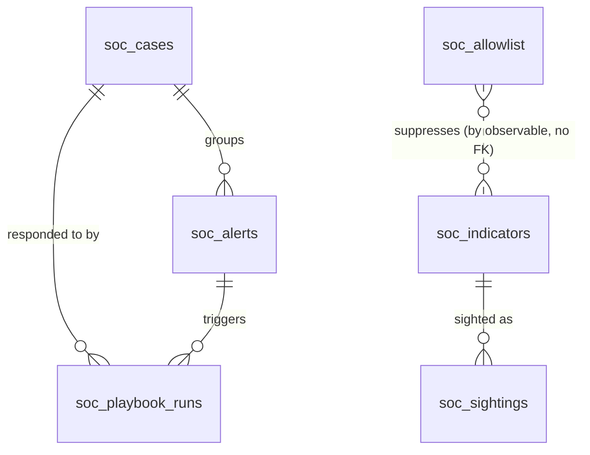

# SOC Platform — Database Schema

The relational schema the five repository ports are backed by.

> **Status: designed, not built.** There is no `alembic/` directory and no
> SQLAlchemy model in `apps/soc/backend` yet. Every repository resolves to
> `adapters/memory/`, so state dies with the process — see `SPECS.md`, Known
> Gaps. This document is the target the persistence work implements, and the
> reference for reviewing it when it lands.

Read `SPECS.md` first for what the terms mean. This file only says how they are
stored.

## What is *not* in Postgres

**Events.** Neither `RawEvent` nor `NormalizedEvent` gets a table. Events are
high-volume append-only telemetry with full-text and time-range query needs —
that is what `DocumentSearchPort` and its OpenSearch adapter are for. Postgres
holds only the six things the platform *owns and mutates*: indicators,
sightings, allowlist entries, alerts, cases, and playbook runs.

The consequence is deliberate and worth stating plainly: **the relational side
can never answer "which alerts mention this IP".** Observables are stored as
JSONB, not child tables, because the search index answers that question. If
OpenSearch is ever made optional, this decision has to be revisited — it is the
single assumption the JSONB choice rests on.

## Conventions

| | |
|---|---|
| Table prefix | `soc_` — the monorepo shares a database in development |
| Primary keys | native `UUID`, generated in the domain by `IdGeneratorPort`, never by the database |
| Timestamps | `TIMESTAMP(timezone=True)`, always UTC |
| Enums | `VARCHAR(32)`, **not** Postgres `ENUM` — matches `apps/tfc`, and avoids a migration for every new `StrEnum` member |
| Collections | `JSONB` (`tuple[str, ...]`, `Mapping[str, str]`, `tuple[Observable, ...]`) |
| Value objects | flattened to columns with the field name as prefix — `CaseRef` → `external_ref_system`, `external_ref_external_id`, `external_ref_url` |

`Observable` is flattened everywhere it appears as a pair of columns,
`observable_type` + `observable_value`, because that pair is a unique key twice
over. The value is always the canonical form — `observable_policy.canonicalize`
is the only thing allowed to produce it, and the mapper is the only place that
calls it on the way in.

## Entity relationships



`soc_allowlist` has no foreign key to `soc_indicators`: an allowlist entry is
written for an observable that may have no indicator record at all, and must
keep suppressing it if the indicator is later revoked.

## Tables

### `soc_indicators` — what we know about an observable

Maps `domain.indicator_entity.Indicator`.

```sql
CREATE TABLE soc_indicators (
    indicator_id      UUID         PRIMARY KEY,
    observable_type   VARCHAR(32)  NOT NULL,
    observable_value  TEXT         NOT NULL,
    confidence        SMALLINT     NOT NULL,
    status            VARCHAR(32)  NOT NULL,
    threat_labels     JSONB        NOT NULL DEFAULT '[]',
    tlp               VARCHAR(32)  NOT NULL,
    first_seen        TIMESTAMPTZ  NOT NULL,
    last_seen         TIMESTAMPTZ  NOT NULL,
    sighting_count    INTEGER      NOT NULL DEFAULT 0,
    source            TEXT         NOT NULL,
    external_ref      TEXT,
    CONSTRAINT ux_soc_indicators_observable UNIQUE (observable_type, observable_value),
    CONSTRAINT ck_soc_indicators_confidence CHECK (confidence BETWEEN 0 AND 100)
);
CREATE INDEX ix_soc_indicators_decay ON soc_indicators (status, last_seen);
```

`ux_soc_indicators_observable` is what makes `upsert` mean upsert. Two intel
feeds reporting the same IP must update one row, not insert two — get the
`ON CONFLICT` target wrong and the duplication is silent.

`ix_soc_indicators_decay` serves the confidence-decay sweep, which scans active
indicators by staleness. `CHECK (confidence BETWEEN 0 AND 100)` mirrors the
invariant `Confidence.__post_init__` already enforces in the domain; it is
there so a bad row cannot be written by hand or by a future migration.

### `soc_sightings` — that we saw it in our own telemetry

Maps `domain.indicator_entity.Sighting`.

```sql
CREATE TABLE soc_sightings (
    sighting_id   UUID         PRIMARY KEY,
    indicator_id  UUID         NOT NULL REFERENCES soc_indicators (indicator_id) ON DELETE CASCADE,
    event_id      UUID         NOT NULL,
    observed_at   TIMESTAMPTZ  NOT NULL,
    source        TEXT         NOT NULL,
    asset         TEXT
);
CREATE INDEX ix_soc_sightings_indicator ON soc_sightings (indicator_id, observed_at DESC);
```

`event_id` is **not** a foreign key — the event lives in OpenSearch. It is a
correlation handle, and the schema should not pretend otherwise.

`soc_indicators.sighting_count` is denormalised on purpose: the count is read on
every triage and would otherwise cost an aggregate per observable per event.
It is maintained by the repository in the same statement that inserts the
sighting.

### `soc_allowlist` — observables that may never raise severity

Maps `domain.indicator_entity.AllowlistEntry`.

```sql
CREATE TABLE soc_allowlist (
    entry_id          UUID         PRIMARY KEY,
    observable_type   VARCHAR(32)  NOT NULL,
    observable_value  TEXT         NOT NULL,
    match_kind        VARCHAR(32)  NOT NULL,
    reason            TEXT         NOT NULL,
    created_by        TEXT         NOT NULL,
    created_at        TIMESTAMPTZ  NOT NULL,
    expires_at        TIMESTAMPTZ,
    CONSTRAINT ux_soc_allowlist_entry UNIQUE (observable_type, observable_value, match_kind)
);
CREATE INDEX ix_soc_allowlist_expiry ON soc_allowlist (expires_at);
```

`match_kind` is part of the key: the same value may legitimately be allowlisted
both `exact` and as a `domain_suffix`, and those are different rules.

Expiry is a **predicate, not a state** — nothing sweeps this table. A lookup
filters `expires_at IS NULL OR expires_at > now()`, which must match
`allowlist_policy` exactly. That equivalence is the reason the allowlist
repository is worth a contract test at all.

### `soc_cases` — the investigation record

Maps `domain.case_entity.Case`. `CaseRef` is flattened into the three
`external_ref_*` columns.

```sql
CREATE TABLE soc_cases (
    case_id                   UUID         PRIMARY KEY,
    correlation_key           TEXT         NOT NULL,
    title                     TEXT         NOT NULL,
    status                    VARCHAR(32)  NOT NULL,
    severity                  VARCHAR(32)  NOT NULL,
    alert_ids                 JSONB        NOT NULL DEFAULT '[]',
    opened_at                 TIMESTAMPTZ  NOT NULL,
    updated_at                TIMESTAMPTZ  NOT NULL,
    closed_at                 TIMESTAMPTZ,
    external_ref_system       TEXT,
    external_ref_external_id  TEXT,
    external_ref_url          TEXT,
    CONSTRAINT ck_soc_cases_external_ref CHECK (
        (external_ref_system IS NULL) = (external_ref_external_id IS NULL)
    ),
    CONSTRAINT ck_soc_cases_closed_at CHECK (
        (status IN ('closed_resolved', 'closed_false_positive')) = (closed_at IS NOT NULL)
    )
);
CREATE INDEX ix_soc_cases_correlation ON soc_cases (correlation_key);

CREATE UNIQUE INDEX ux_soc_cases_open_correlation_key
    ON soc_cases (correlation_key)
    WHERE status NOT IN ('closed_resolved', 'closed_false_positive');
```

**The partial unique index is the most important line in this file.** It
enforces "at most one *open* case per correlation key" in the database rather
than in a read-then-write in Python. Two points about it:

- It is why **SQLite is not an acceptable test target.** SQLite degrades this
  to a full unique index, which would wrongly forbid two *closed* cases sharing
  a correlation key — a test that passes locally and lies.
- `find_open_by_correlation_key` must exclude terminal statuses **in SQL**, with
  the same predicate. Filter in Python instead and closed cases block new
  investigations forever: the platform quietly stops opening cases, and nothing
  errors.

`ck_soc_cases_closed_at` encodes what `case_policy.transition` already does —
`closed_at` is set exactly when the status is terminal, and terminal statuses
are absorbing (`ALLOWED_TRANSITIONS` maps both to the empty set).

### `soc_alerts` — a persisted, actionable finding

Maps `domain.verdict_entity.Alert`.

```sql
CREATE TABLE soc_alerts (
    alert_id           UUID         PRIMARY KEY,
    event_id           UUID         NOT NULL,
    dedup_key          TEXT         NOT NULL,
    correlation_key    TEXT         NOT NULL,
    title              TEXT         NOT NULL,
    severity           VARCHAR(32)  NOT NULL,
    disposition        VARCHAR(32)  NOT NULL,
    score              INTEGER      NOT NULL,
    reasons            JSONB        NOT NULL DEFAULT '[]',
    observables        JSONB        NOT NULL DEFAULT '[]',
    source             TEXT         NOT NULL,
    host               TEXT,
    asset_criticality  VARCHAR(32)  NOT NULL,
    occurred_at        TIMESTAMPTZ  NOT NULL,
    created_at         TIMESTAMPTZ  NOT NULL,
    case_id            UUID         REFERENCES soc_cases (case_id) ON DELETE SET NULL,
    labels             JSONB        NOT NULL DEFAULT '[]',
    CONSTRAINT ux_soc_alerts_dedup_key UNIQUE (dedup_key)
);
CREATE INDEX ix_soc_alerts_correlation ON soc_alerts (correlation_key);
CREATE INDEX ix_soc_alerts_recent      ON soc_alerts (created_at DESC);
```

`ux_soc_alerts_dedup_key` closes the duplicate-alert race. `IngestEventUseCase`
does `find_by_dedup_key` then `save`; under concurrency both callers can read
"absent" and both insert. The repository must therefore **catch `IntegrityError`
and re-read**, returning the winning row, so a concurrent replay is deduplicated
rather than raising a 500.

`ix_soc_alerts_recent` serves `GET /api/alerts`, which lists newest-first.

**The alert↔case link is stored twice** — `soc_alerts.case_id` and
`soc_cases.alert_ids` — and the two writes are separate
(`EscalateAlertUseCase._link_alert` and `case_policy.merge_alert`). They agree
only because both happen inside one request transaction. Anything that commits
between them can leave them inconsistent; `soc_alerts.case_id` is the
authoritative side, and `alert_ids` is a read convenience.

### `soc_playbook_runs` — what response we took

Maps `domain.playbook_entity.PlaybookRun`. `PlaybookHandle` is flattened into
the three `handle_*` columns.

```sql
CREATE TABLE soc_playbook_runs (
    run_id               UUID         PRIMARY KEY,
    idempotency_key      TEXT,
    playbook_id          TEXT,
    status               VARCHAR(32)  NOT NULL,
    inputs               JSONB        NOT NULL DEFAULT '{}',
    started_at           TIMESTAMPTZ  NOT NULL,
    alert_id             UUID         REFERENCES soc_alerts (alert_id) ON DELETE SET NULL,
    case_id              UUID         REFERENCES soc_cases  (case_id)  ON DELETE SET NULL,
    handle_system        TEXT,
    handle_external_id   TEXT,
    handle_continuation  TEXT,
    output               JSONB        NOT NULL DEFAULT '{}',
    error                TEXT,
    finished_at          TIMESTAMPTZ,
    CONSTRAINT ux_soc_playbook_runs_idempotency UNIQUE (idempotency_key)
);
CREATE INDEX ix_soc_playbook_runs_case  ON soc_playbook_runs (case_id);
CREATE INDEX ix_soc_playbook_runs_alert ON soc_playbook_runs (alert_id);
```

`ux_soc_playbook_runs_idempotency` is what makes "containment fires once" a
guarantee rather than a hope, with the same `IntegrityError`-then-re-read
handling as alerts.

**`idempotency_key` and `playbook_id` must be nullable.** A `SKIPPED` run
represents "no playbook matched", and today
`RespondToAlertUseCase._skip` writes `""` for both. `''` is a value, not `NULL`,
so under this unique constraint the *second* skipped alert would fail to
insert. The domain field must become `str | None` with `None` for skips —
Postgres excludes `NULL` from unique indexes, which is exactly the wanted
behaviour. **This is a prerequisite for the migration, not a follow-up.**

## Open decision — a secret at rest

`handle_continuation` holds the orchestrator's per-execution authorization
token. Persisting it means **storing a credential in plaintext in the
database**, readable by anything with a connection or a backup.

The two honest options:

1. **Keep the column, accept and document the exposure.** In-flight outcomes
   remain re-readable after a restart. Needs the column excluded from any log,
   dump, or API projection, and a note in the deployment docs.
2. **Drop the column.** In-flight executions launched before a restart can no
   longer be polled; they stay `RUNNING` until an operator resolves them.

This is a deployment-risk trade-off, not an implementation detail. It must be
decided explicitly before the migration is written — the default of "just add
the column" is option 1 chosen silently.

## Migration order

Foreign keys fix the order. `001_initial_soc_schema.py`:

```
upgrade:   indicators → sightings → cases → alerts → allowlist → playbook_runs
downgrade: playbook_runs → allowlist → alerts → cases → sightings → indicators
```

`downgrade()` drops `ux_soc_cases_open_correlation_key` before dropping
`soc_cases` — a partial index created with raw SQL is not dropped by
`op.drop_table` in every backend, and CI runs a per-revision rollback test
(`tests/migration_rollback_test.py`), so the reverse path has to actually work.

## What the tests must cover

CRUD round-trips test SQLAlchemy, not us. Four behaviours here are not CRUD, and
each is a guarantee stated elsewhere in the docs:

| Guarantee | Mechanism | Fails silently as |
|---|---|---|
| One indicator per observable | `ux_soc_indicators_observable` + `ON CONFLICT` | every dual-sourced indicator duplicated |
| At most one open case per correlation key | `ux_soc_cases_open_correlation_key` | two parallel investigations of one incident |
| `find_open_by_correlation_key` excludes terminal statuses | `WHERE` clause matching the partial index | cases stop being opened, forever |
| Replay raises one alert / fires containment once | `UNIQUE` + `IntegrityError`-then-re-read | duplicate alerts; containment fires twice |

The five contract classes in `adapters/contract/repository_contract.py` already
encode the first three. Pointing them at Postgres costs one file. The fourth is
concurrency behaviour and needs two dedicated tests — a concurrent duplicate
event, and a concurrent double response.
